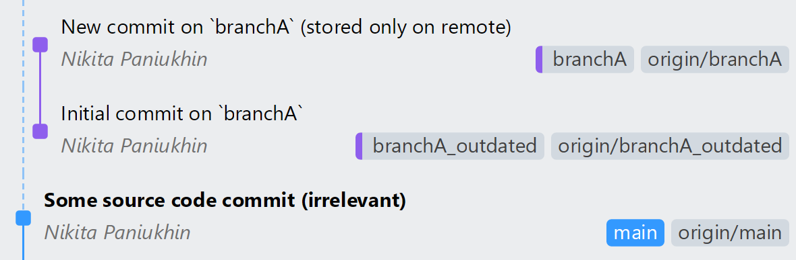

<h1 align="center">Git Conflict Detector 2</h1>

This project identifies files on a local branch (`branchB`) that have also been modified in the remote branch (`origin/branchA`) since the last common commit ancestor (merge base) using `git` and the GitHub API, without fetching the remote branch to the local machine.

The real-life purpose of this application is to help developers detect potential conflicts before merging changes, allowing them to resolve issues in advance.


## Overview

The CLI tool is implemented in Java

The repository includes Bash (`.sh`) and Batch (`.cmd`) scripts to make setting up the built-in demo more convenient.


## Demo

The repository includes demo branches that replicate the scenario described in the project's specification. Once the demo is set up, the repository will be structured as follows:

- A shared merge-base commit (referred to as `branchA_outdated`)
- A remote-only branch `branchA`, which is one commit ahead of the merge-base commit
- A local-only branch `branchB`, which is also one commit ahead of the merge-base commit

<a id="origin"></a>
> [!NOTE]
> The project does not rely on a local copy of `branchA`, meaning it may be out of sync with `origin/branchA` or even absent entirely. In this demo, `branchA` exists only remotely to emphasize this. That's why I prefix it with `origin/` — ensuring that `git merge-base branchB origin/branchA` works correctly. Without this, `git merge-base branchB branchA` would fail if `branchA` is missing locally.

For your convenience, here is a visual representation:


### Prerequisites

For accessing private repositories (not need for the demo):
- GitHub API access token [generated here](https://github.com/settings/personal-access-tokens) with `Read` access to `Contents` for the desired repository


### Setup

1. Clone the repository to your local machine

2. Set up the Git structure by running the provided `setup` script (`setup.cmd` or `./setup.sh`)

    <details>
    <summary>Git structure before and after setup, for reference (click to expand)</summary>

    <br>
    <div align="center"><b>Before setup</b></div>
    

    <br>
    <br>
    <div align="center"><b>After setup</b></div>
    

    </details>

3. Run the script with the demo arguments: `branchB [origin/]branchA repo_owner repo_name [--access_token] [--repo_path]`

    `get_diff.cmd` and `./get_diff.sh` are provided for your convenience. For example:

    ```bash
    ./get_diff.sh branchB origin/branchA npanuhin edu-JetBrains-Git-Conflict-Detector
    # or
    python3 get_diff.py branchB branchA npanuhin edu-JetBrains-Git-Conflict-Detector
    # or (if this repository was private and located in a different directory)
    python3 get_diff.py branchB branchA npanuhin edu-JetBrains-Git-Conflict-Detector --access_token {github_token} --repo_path ../some_path/
    ```

    Parameters:
    - `branchB` — local branch, which will be checked for conflicts
    - `[origin/]branchA` — remote branch, which we compare against. `origin/` will be added automatically, if omitted[^1]
    - `repo_owner`, `repo_name` — GitHub repository owner and name
    - `--access_token {github_token}` — GitHub API token. Not required for public repositories
    - `--repo_path {local_path}` — path to the local repository. By default, the current directory is used

    <br>
    <details>
    <summary>Click here to see the expected output</summary>

    ```py
    --- Potential Conflicts ---

    Conflict: file_in_root.txt
      origin/branchA: Modified   file_in_root.txt
      branchB:        Modified   file_in_root.txt

    Conflict: folder_in_root/empty_file.txt
      origin/branchA: Modified   folder_in_root/empty_file.txt
      branchB:        Modified   folder_in_root/empty_file.txt

    Conflict: folder_in_root/folder_nested/created_file.txt
      origin/branchA: Added      folder_in_root/folder_nested/created_file.txt
      branchB:        Added      folder_in_root/folder_nested/created_file.txt

    Conflict: folder_in_root/folder_nested/deleted_file.txt
      origin/branchA: Removed    folder_in_root/folder_nested/deleted_file.txt
      branchB:        Removed    folder_in_root/folder_nested/deleted_file.txt

    Conflict: folder_in_root/folder_nested/file_in_folders.txt
      origin/branchA: Modified   folder_in_root/folder_nested/file_in_folders.txt
      branchB:        Modified   folder_in_root/folder_nested/file_in_folders.txt

    Conflict: folder_in_root/truly_renamed_file.txt
      origin/branchA: Renamed    folder_in_root/folder_nested/renamed_file.txt -> folder_in_root/truly_renamed_file.txt
      branchB:        Renamed    folder_in_root/folder_nested/renamed_file.txt -> folder_in_root/truly_renamed_file.txt
    ```

    </details>

4. If you want to reset the Git structure to the initial state, you can either run `rollback.cmd` or `./rollback.sh`, or clone the repository again


[^1]: The reson for adding `origin` is [mentioned here](#origin). Is is possible to fetch the list of remotes using `git remote`, so if for example `branchA` is not on `origin`, we might detect that. This is one of the potential improvements for the project
